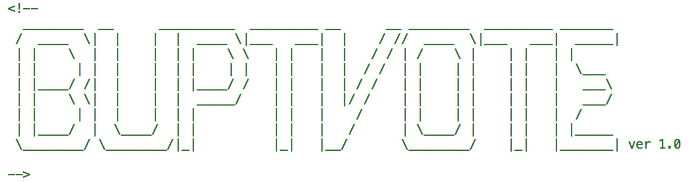
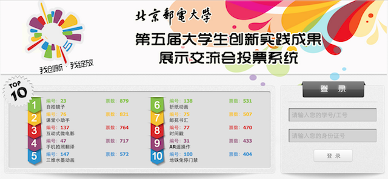
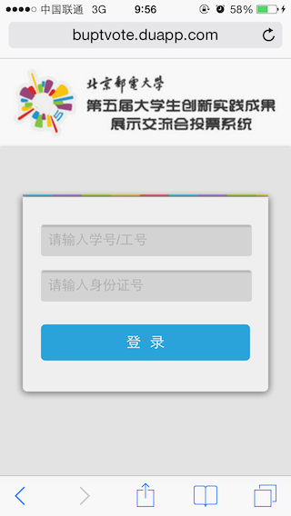

#北邮第五届创新展投票系统

##项目介绍

此项目完成于2013年4月，系为北邮第五届创新展选取最受欢迎的创新项目所服务的。

包含了项目展示，用户登录，用户投票，投票结果前十名图表展示，移动版等。

项目demo请访问：[http://buptvote.duapp.com/](http://buptvote.duapp.com/)

demo中已经关闭投票，不能在进行投票了。

---

##项目依赖

1. php框架 Yii
2. 前端框架 bootstrap
3. jquery
4. fancybox
5. chart.js
6. jquery scroll

---

##使用说明

###声明

**`推卸责任声明=_=`**此项目系大三时所写，代码比较稚嫩，后续又没有维护过
，所以可能会缺乏注释、比较难懂等。原谅我吧～

###源代码

+ `/sqlfile`文件夹中有数据库表结构和所有项目信息。
+ 其余文件夹（除`/screenshot`外）均为项目源代码，yii原生目录结构。
+ `app.conf`文件为`bae`配置文件，在非`bae`环境中使用可以忽略。

###数据库表

数据库表结构及数据均在`/sqlfile`文件夹中。

+ `vote_structure.sql` 是所有的表结构
+ `vote_project_data.sql` 是所有项目的信息

---

##感谢

> 亲爱的刘婷，我的女朋友。我们因为此项目结缘，并走到了一起。

> 马跃，不离不弃的小伙伴。

> 刘学思，敬爱的学长。

> 我自己，连续两周晚上在教三设计着，构思着，coding着，打造出了这个令人欣慰的作品，这是我目前为止最值得骄傲和自豪的作品之一。

> 感谢那美好的时光.
